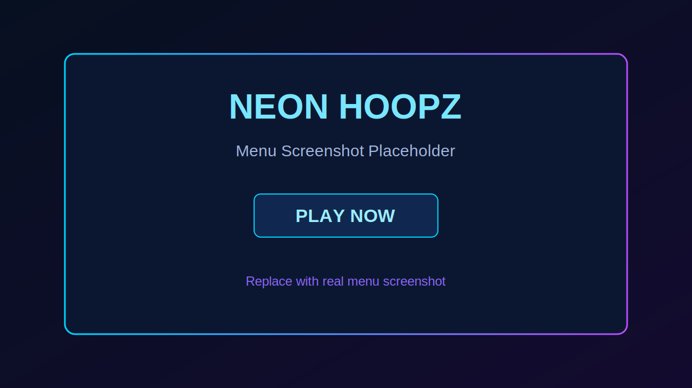
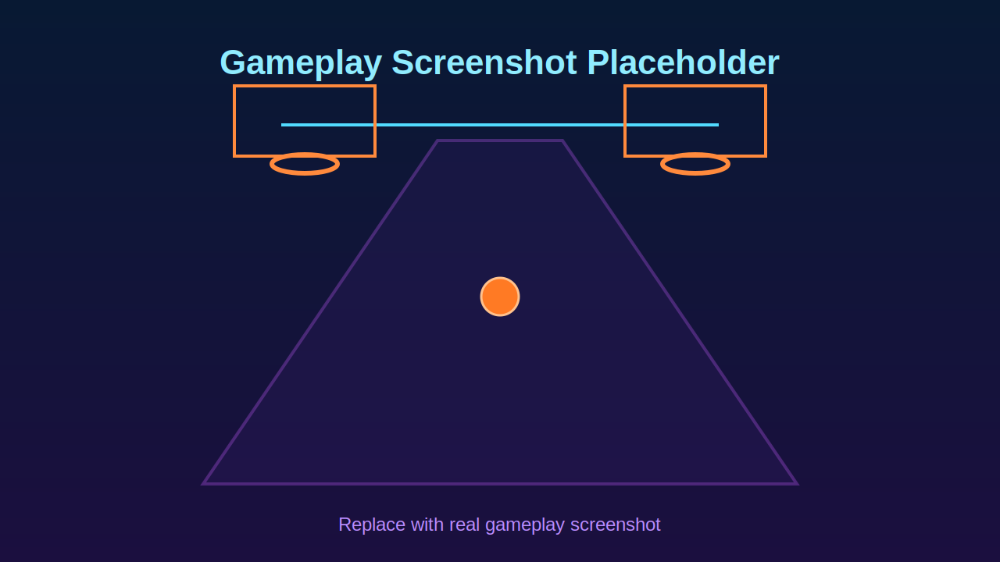
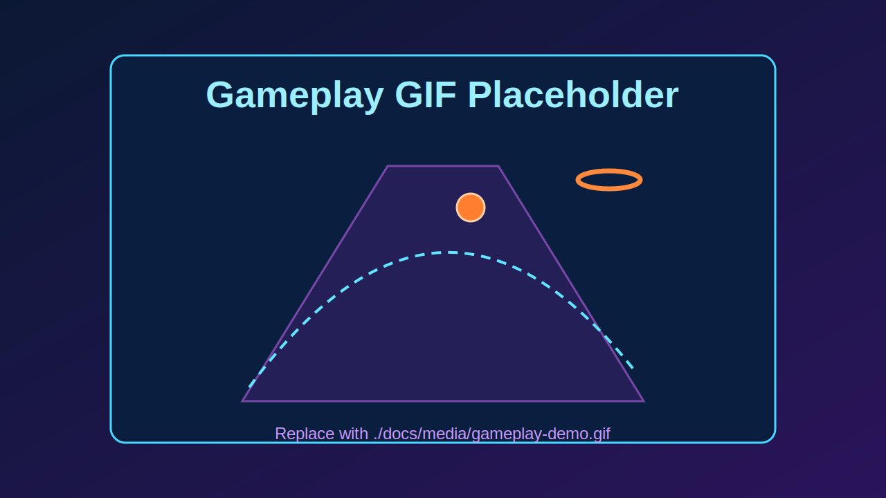

# Neon Hoopz

Neon Hoopz is a neon arcade basketball game packaged with Expo for mobile play.

## Play On Android (APK)

- Direct APK download: https://expo.dev/artifacts/eas/gT7AZLAtqeEuLAatVp7xi8.apk
- Build page: https://expo.dev/accounts/andre22155.b/projects/neon-hoopz-expo/builds/809c14e6-d2ae-4906-8220-47d92f73effd

If Android blocks install, allow `Install unknown apps` for your browser/files app, then retry the APK.

## Play Online (GitHub Pages)

- Permanent URL: https://andre22155b-del.github.io/Neon-Hoopz/

If this URL shows 404 the first time, enable Pages in repository settings:
- GitHub repo -> Settings -> Pages
- Build and deployment -> Source: `Deploy from a branch`
- Branch: `main` and folder: `/docs`

## Screenshots

### Menu / HUD



### Gameplay View



## Gameplay GIF



Replace the placeholder with your real capture at `./docs/media/gameplay-demo.gif` and update this line in README:

```md

```

## Run Locally

Requirements:
- Node.js 18+
- npm
- Expo Go app (optional for local testing)

Install:

```bash
npm install
```

Start Expo dev server:

```bash
npm start
```

## Build Android APK

Preview APK build:

```bash
npx eas build -p android --profile preview
```

## Useful Scripts

- `npm start` - Start Expo
- `npm run android` - Run Android (native run flow)
- `npm run ios` - Run iOS (native run flow)
- `npm run sync:game` - Sync latest bundled game HTML from the web build
- `npm run sync:web` - Sync latest web build into `/docs` for GitHub Pages
- `npm run eas:build:android:apk` - EAS preview APK build

## Project Structure

- `App.js` - Expo app shell and WebView host
- `src/generatedGameHtml.js` - Embedded/offline game payload
- `scripts/sync-local-game.mjs` - Build sync script for embedded game HTML
- `app.json` / `eas.json` - Expo/EAS config
- `docs/media/` - README screenshots and gameplay media
